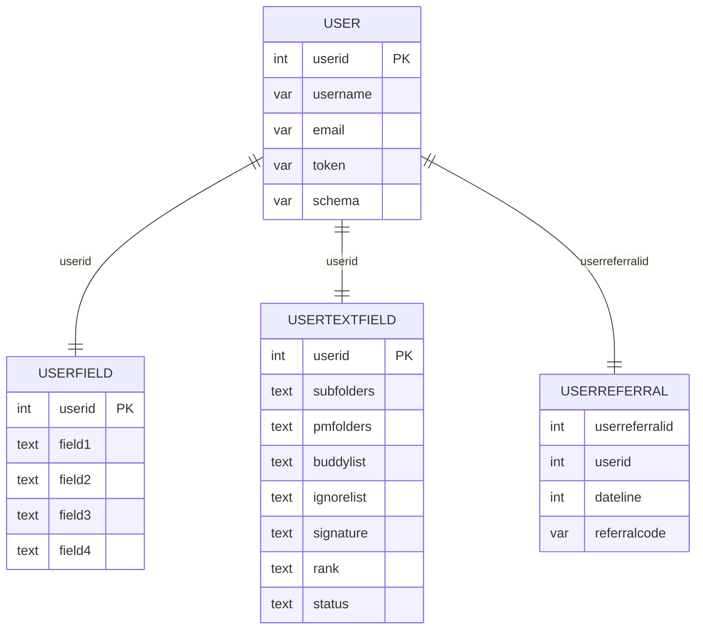

```mermaid
erDiagram
    USER {
        int userid PK
        var username
        var email
        var token
        var schema
    }
    USER ||--|| USERFIELD : userid
    USERFIELD {
        int userid PK
        text field1
        text field2
        text field3
        text field4
    }
    USER ||--|| USERTEXTFIELD : userid
    USERTEXTFIELD {
        int userid PK
        text subfolders
        text pmfolders
        text buddylist
        text ignorelist
        text signature
        text rank
        text status
    }
    USER ||--|| USERREFERRAL : userreferralid
    USERREFERRAL {
        int userreferralid
        int userid
        int dateline
        var referralcode
    }
```
