> This information is based on experience and comments overheard over the years. If there are any errors, please let me know.

## vBulletin Cloud Architecture

vBulletin Cloud is a mixed-tenant SAAS (Software As A Service) application.  The system works in this in this manner:

- There is a single set of vBulletin Files shared between Cloud Sites
- Each Cloud site has their own database.
- Each Cloud site has their own file storage directory.
- A site configuration database is used. This is used instead of reading the database connection information from the config.php files.

Here is a simplified diagram of the architecture:

```mermaid
---
config:
  layout: dagre
---
flowchart LR
 subgraph subGraph0["Client Devices"]
        A1["xxxx.vbulletin.net Request"]
        A2["yyyy.vbulletin.net Request"]
        A3["zzzz.vbulletin.net Request"]
  end
 subgraph subGraph1["Web Tier"]
        WA["vBulletin.net Virtual Machines"]

  end
 subgraph subGraph2["Database Tier"]
        DB1[("xxxx.vbulletin.net Database")]
        DB2[("yyyy.vbulletin.net Database")]
        DBN[("zzzz.vbulletin.net Database")]
        CN[(Configuration Server)]
  end
 subgraph s1["Site File Storage"]
        FS["Attachments, Avatars, Smilies, etc…"]
  end
    A1 <--> WA
    A2 <--> WA
    A3 <--> WA
    WA <--> CN & DB1 & DB2 & DBN & FS
```

## Displaying a vBulletin Cloud Page

1. End User requests a page from `subdomin.example.com`.
2. The CNAME Redirect on that subdomain redirects the request to abcd.vbulletin.net
3. The webservers at vbulletin.net query the configuration database to see if the site is active (i.e they paid their bills)
	-  If it is active then:
		1. A connection to the customer's database is created.
		2. The content requested is retrieved.
		3. The content is sent to the end user.
	- If is is inactive then an error page is shown. 

Here is a flowchart of how a page request is handled:

